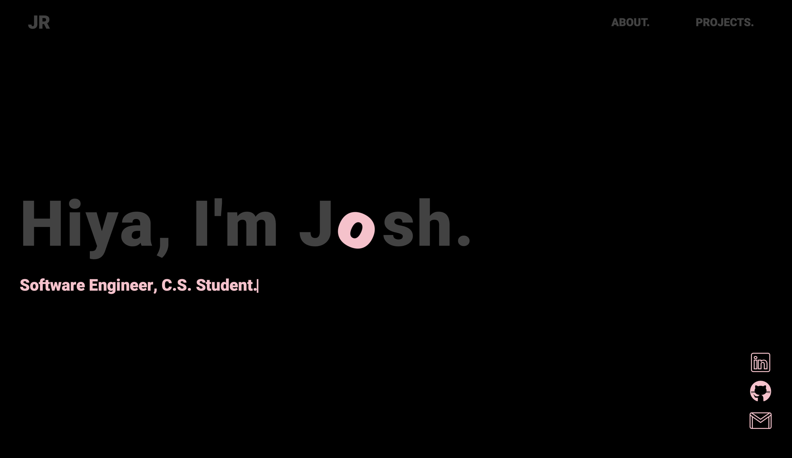
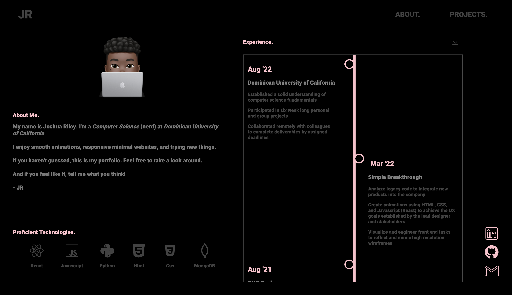
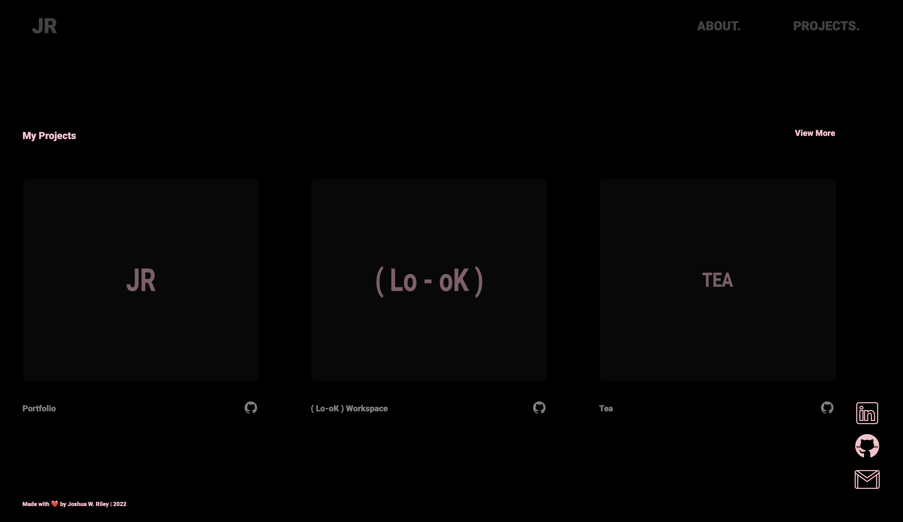
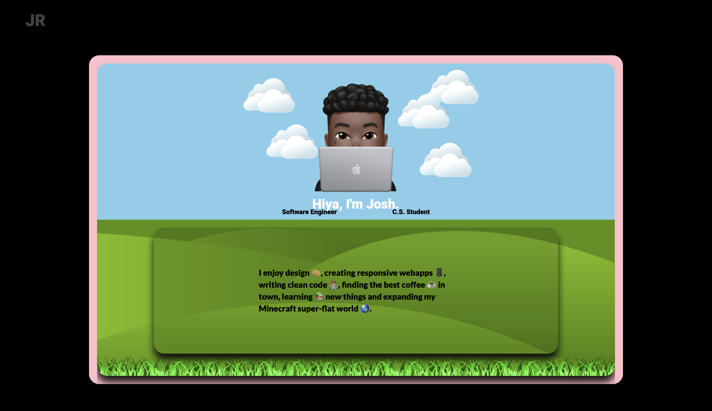

# Portfolio Project

[LIVE SITE](https://joshriley.tech).
[DEMO HERE](https://drive.google.com/file/d/1Ljz6cZclCRw-4XozHdnxkU0LuefkTqz6/view).

# Why?
The goal of this project was to showcase what I've learned about HTML, CSS, and Javascript over the course of my time at Dominican University of California.

# What?
This is my updated, and most recent portfolio. It only gets better over time.

# How?
This project is made with the following technologies.

* HTML
* CSS
* Javascript

# How to run the project locally

1. git clone
2. Open in your favorite text editor (mine is VSCode)
3. Open index.html with live-server (may be different depending on your text editor)